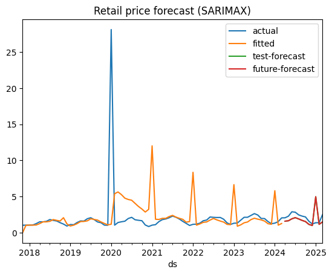

# Retail Price Forecasting & Supply Chain Optimisation
[](https://colab.research.google.com/github/TejasBornare97/retail-price-forecasting-and-optimisation/blob/main/notebooks/Business_Data_Analytics_UPDATED_1.ipynb)

Time‑series forecasting for retail prices (with ARIMA/SARIMA/Holt‑Winters/Prophet) **plus** a linear‑programming based supply chain optimisation (PuLP). The goal is to forecast product prices, compare model performance, and minimise end‑to‑end supply costs across suppliers and warehouses.

## Project Structure
```
retail-price-forecasting-and-optimisation/
├─ data/
│  ├─ price_dataset.xlsx
│  ├─ fuel_price.xlsx
│  └─ supply_chain_data.csv
├─ notebooks/
│  └─ Business_Data_Analytics_UPDATED_1.ipynb
├─ report/
│  └─ Retail prediction.docx
├─ src/            # (optional) put any .py helpers here
├─ requirements.txt
├─ .gitignore
├─ LICENSE
└─ README.md
```

## Highlights
- Multi‑model time‑series forecasting: **ARIMA**, **SARIMA**, **Holt‑Winters**, and **Prophet**.
- Exogenous variable experimentation (e.g., **fuel prices**) via ARIMAX/SARIMAX.
- Model evaluation with RMSE/MAE/MAPE and residual diagnostics.
- **Supply chain optimisation** using **PuLP**: minimise total cost subject to supplier capacity and warehouse demand.
- Clean, reproducible folder layout and pinned Python dependencies.

## Data
- `data/price_dataset.xlsx` – monthly retail price series.
- `data/fuel_price.xlsx` – monthly fuel price series for exogenous analysis.
- `data/supply_chain_data.csv` – inputs for the optimisation model (suppliers, warehouses, costs, capacities, demand).

> Replace these with your own data if needed and keep the same schemas referenced in the notebook.

## Quickstart
1. **Create and activate an environment (recommended):**
   ```bash
   python -m venv .venv
   # Windows
   .venv\Scripts\activate
   # macOS/Linux
   source .venv/bin/activate
   ```
2. **Install dependencies:**
   ```bash
   pip install -r requirements.txt
   ```
3. **Run the notebook:**
   ```bash
   jupyter lab
   # or
   jupyter notebook
   ```
   Open `notebooks/Business_Data_Analytics_UPDATED_1.ipynb` and run all cells.

## Results
Model: SARIMAX (1,1,1)x(1,1,1,12) on monthly data.




## Reproducing Results
- Forecasting: compare ARIMA/SARIMA/Holt‑Winters/Prophet, with/without exogenous regressors (fuel prices).
- Optimisation: solve the minimum‑cost shipment plan with PuLP and inspect allocation and cost summaries.

## Notes
- GitHub has a 100 MB **per‑file** limit for regular repos. If any file exceeds this, consider Git LFS.
- Prophet may require a C++ build toolchain on some systems. If install issues occur, see the Prophet docs.

## License
This project is released under the MIT License (see `LICENSE`).


Originally built in 2020 (college); modernised in 2025 (migrated to Python 3.11/Prophet 1.x; added CI/tests). Both a college-era environment and a modern environment are provided for reproducibility.

